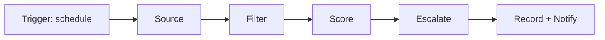

# Architecture

This describes how the agent works and why it's built this way. If you want to know what to click, see the Setup Guide instead; this doc is for understanding the design, not operating it.

## What this actually is

An operating manual (a markdown file) plus a set of MCP connectors (job source, spreadsheet, email), run by Claude on a fixed schedule. There's no custom code. The manual is the entire program; Claude is the runtime. Everything below describes the shape that manual has to take for the system to hold up over months of unattended runs, not just on day one.

## The pipeline

Each scheduled run moves through six stages, in order:

1. **Trigger.** A scheduled task fires on the configured cadence (for example, Monday/Wednesday/Friday mornings). Off-cycle runs require an explicit human request.
2. **Source.** The agent pulls candidates from whatever's connected, in a fixed priority order (a named primary source first, secondary sources only if the primary comes up short). It does not search everywhere every time; that's a token-cost decision, not a coverage decision.
3. **Filter.** Hard rules run before any scoring: excluded companies, geography that's flatly disqualifying, salary floors, roles already in the tracker. This exists purely to avoid spending evaluation effort on candidates that were never going to survive.
4. **Score.** Every surviving candidate gets scored on a fixed rubric, in two passes: cheap (snippet-only) first to cut the field down, expensive (full job description) second on a small finalist set only. See "Two-stage scoring" below.
5. **Escalate.** Anything the rubric can't confidently resolve on its own gets flagged back to a human instead of decided silently. See "What's automated vs. human" below.
6. **Record and notify.** Results get written to persistent storage (a tracking spreadsheet) and summarized to the human (a formatted digest). The spreadsheet is what makes the next run's filtering possible; without it, step 3 can't dedupe against history.

## Design decisions, and why

**Two-stage scoring.** Fetching and reading a full job description costs meaningfully more than reading a search snippet. Scoring every candidate on full detail would work, but it's wasteful when most candidates are obviously wrong on sight. Scoring cheap first, then expensive on a short list, gets close to the same evaluation quality at a fraction of the cost.

**Escalation instead of full autonomy.** The rubric can score a role, but it can't know things like "I already have a soft no from this company and want to be asked before a second try," or "this salary is $2K under my floor and I'd rather decide that myself than have a rule decide it for me." Rather than trying to encode every judgment call into the rubric, the system defers a defined set of situations back to a human and treats everything else as decidable. The list of what escalates is itself part of the manual, and it's expected to grow as new edge cases show up.

**Company and pipeline state, not a flat list.** A binary include/exclude list breaks down within weeks of real use, because real exclusions aren't binary: some are temporary (an active application in review), some are permanent (a company you never want to see again), and some need a human decision each time (a past rejection that might be worth a second look under a different team). The manual encodes this as a small state machine: Paused, Suppressed, Ask-before-resurfacing, with rules for how items move between states. Closed pipeline items are recorded with an outcome and a resurface rule, not deleted, because "why did this close" is exactly the information that prevents wasted repeat effort later.

**Scoring overrides on top of the averaged rubric.** A six-dimension average can hide one disqualifying trait behind a strong overall number, for example a role that pays extremely well but requires a skill the candidate doesn't have at all. The manual layers explicit caps on top of the averaged score for known failure patterns, so a single dealbreaker can't get washed out by unrelated strengths.

**A gray zone between GO and NO.** Clearing a numeric threshold isn't the same as being worth applying to. The manual defines a middle band where the system defaults to *not* recommending action unless a human logs a specific reason to stretch. Without this, a system tuned to maximize "roles found" quietly turns into a system that recommends applying to everything survivable, which isn't the same as recommending good use of a limited weekly application budget.

**Run limits and self-reporting as first-class behavior, not an afterthought.** This runs on a metered subscription, often unattended. A single run that goes sourcing-heavy can consume a disproportionate amount of budget before anyone notices. The manual sets a hard step cap per run and requires the agent to report its own resource usage at the end of every run, so degrading sourcing quality or an unusually expensive day shows up immediately instead of being discovered later.

**A versioned manual.** Decisions made once should stay made. If a human resolves an escalation ("yes, that city is fine") and the manual doesn't record that, the same question resurfaces the next time a similar role appears, and eventually the human stops reading escalations at all. The manual keeps a dated changelog and updates are expected to append entries, not silently rewrite prior sections, so the reasoning behind a rule stays attached to the rule.

## The connector model

The agent doesn't have any built-in ability to search job boards, write to spreadsheets, or send email. Those capabilities come entirely from MCP connectors, small integrations that expose an outside service's actions as tools Claude can call. This has one direct consequence worth being explicit about: the system can only do what's connected. A manual can specify a beautifully designed sourcing strategy across five job boards, and none of it will run if only one connector is actually enabled. Checking what's connected is a setup step, not an assumption.

Three connector categories this system depends on:
- A job source (a job board's search and detail-lookup tools)
- A spreadsheet or document store (the tracker's persistent home)
- Optionally, email (for digest delivery; without it, output lands in the chat only)

## What's automated vs. what's human

| Automated | Always human |
|---|---|
| Sourcing, filtering, scoring | Submitting an application |
| Writing to the tracker | Resolving an escalation |
| Drafting a tailored resume | Changing targeting criteria or scoring thresholds |
| Reporting resource usage | Approving manual edits proposed at a retro |

The dividing line isn't "what's hard to automate," it's "what should stay a deliberate choice." Applying to a job and changing the rules that decide what gets surfaced are both treated as decisions a human should actively make, not decisions a system should make well enough to be trusted with by default.

## Where state actually lives

Two places, and they can drift apart if you're not careful:

- **The operating manual** holds the rules: who the candidate is, what they're targeting, how scoring works, what's excluded, what escalates. This changes on the order of weekly at first, then monthly.
- **The tracking spreadsheet** holds the history: every role surfaced, its score, its status, the human's eventual decision. This changes on every run.

When both record pipeline or company status and they disagree, something has to win. The manual should say which one explicitly, because "the tracker was right and the manual was stale" (or the reverse) is a realistic failure mode once a project has been running for a few months across many separate sessions.

## Limitations, by design

- **Sourcing quality varies day to day.** Some runs will turn up a strong slate, some will turn up almost nothing worth surfacing. A thin result is a legitimate output, not a failure to hide.
- **The system is only as good as the rubric written into the manual.** It has no independent judgment about fit beyond what's been specified; a badly calibrated manual produces badly calibrated recommendations with total confidence.
- **There's no fully automated apply step, on purpose.** This is a design choice, not a missing feature. Submitting applications is left to the human even where the system is confident, because that's the one action that's expensive to take back.
- **It needs upkeep.** A manual that never gets revised after the first week will drift out of step with reality faster than most people expect.
